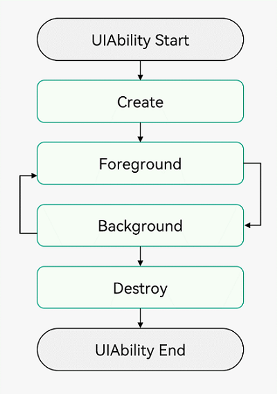
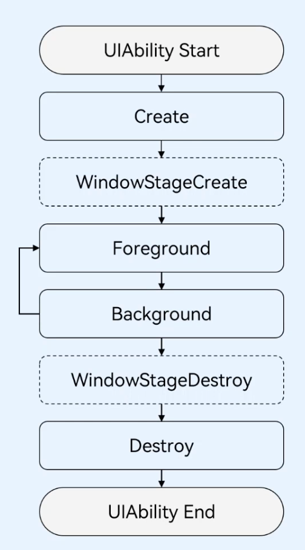
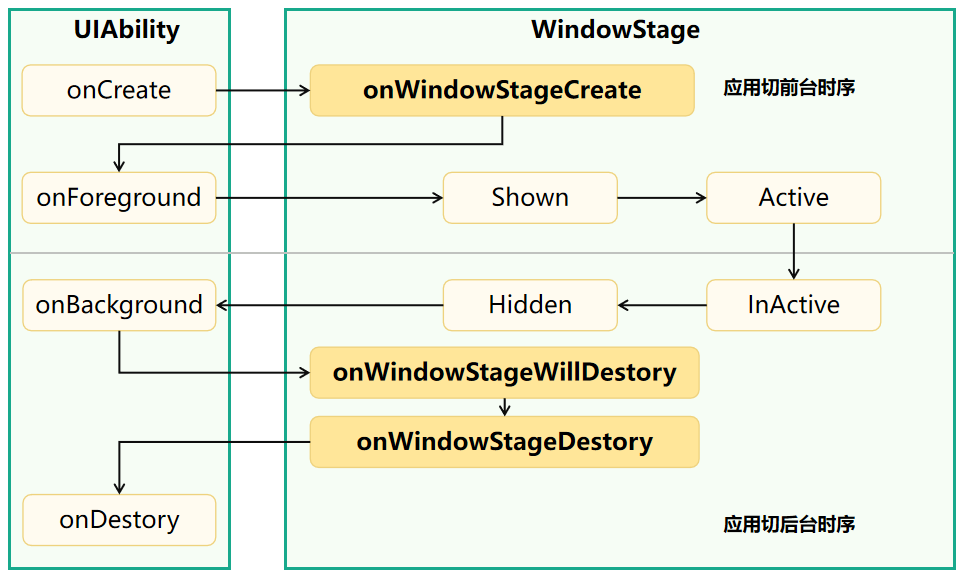

1.  概述

            1.  当用户打开、切换和返回到对应应用时，应用中的 UIAbility 实例会在其生命周期的不同状态之间转换。
            2.  UIAbility 类提供了一系列回调，通过这些回调可以知道当前 UIAbility 实例的某个状态发生改变，
            3.  会经过 UIAbility 实例的创建和销毁，或者 UIAbility 实例发生了前后台的状态切换
            4.  UIAbility 的生命周期包括 Create、Foreground、Background、Destroy 四个状态

    

      
      
    

    

2.  生命周期状态说明

    1.  Create 状态

        1.  Create 状态为在应用加载过程中，UIAbility 实例创建完成时触发，
        2.  系统会调用 onCreate()回调。可以在该回调中进行页面初始化操作，例如变量定义资源加载等，用于后续的 UI 展示
        3.  onCreate 的第一个参数 Want 是对象间信息传递的载体，可以用于应用组件间的信息传递
        4.  当应用的 UIAbility 实例已创建，且 UIAbility 配置为 singleton 启动模式时，再次调用 startAbility()方法启动该 UIAbility 实例时，不会进入其 onCreate()和 onWindowStageCreate()生命周期回调，只会进入该 UIAbility 的 onNewWant()回调。应用可以在该回调中更新要加载的资源和数据等，用于后续的 UI 展示。

    2.  WindowStageCreate 状态

        1.  UIAbility 实例创建完成之后，在进入 Foreground 之前，系统会创建一个 WindowStage。
        2.  WindowStage 创建完成后会进入 onWindowStageCreate()回调，可以在该回调中设置 UI 加载、设置 WindowStage 的事件订阅
        3.  在 onWindowStageCreate()回调中通过 loadContent()方法设置应用要加载的页面，
        4.  并根据需要调用 on('windowStageEvent')方法订阅 WindowStage 的事件（获焦/失焦、可见/不可见）

    3.  WindowStageDestroy 状态
        1.  在 UIAbility 实例销毁之前，则会先进入 onWindowStageDestroy()回调，可以在该回调中释放 UI 资源
    4.  WindowStageWillDestroy 状态

        1.  在 WindowStage 销毁前执行，此时 WindowStage 可以使用

    5.  Foreground 状态

        1.  在 UIAbility 实例切换至前台时触发，对应于 onForeground()回调
        2.  onForeground()回调，在 UIAbility 的 UI 可见之前，如 UIAbility 切换至前台时触发。
        3.  可以在 onForeground()回调中申请系统需要的资源，或者重新申请在 onBackground()中释放的资源

    6.  Background 状态

        1.  在 UIAbility 实例切换至后台时触发，onForeground()回调 onBackground()回调
        2.  在 UIAbility 的 UI 完全不可见之后，如 UIAbility 切换至后台时候触发。
        3.  可以在 onBackground()回调中释放 UI 不可见时无用的资源，或者在此回调中执行较为耗时的操作，例如状态保存等。
        4.  例如应用在使用过程中需要使用用户定位时，假设应用已获得用户的定位权限授权。在 UI 显示之前，可以在 onForeground()回调中开启定位功能，从而获取到当前的位置信息。当应用切换到后台状态，可以在 onBackground()回调中停止定位功能，以节省系统的资源消耗

    7.  Destroy 状态

        1.  Destroy 状态在 UIAbility 实例销毁时触发。可以在 onDestroy()回调中进行系统资源的释放、数据的保存等操作
        2.  例如调用 terminateSelf()方法停止当前 UIAbility 实例，从而完成 UIAbility 实例的销毁；
        3.  或者用户使用最近任务列表关闭该 UIAbility 实例，完成 UIAbility 的销毁。
